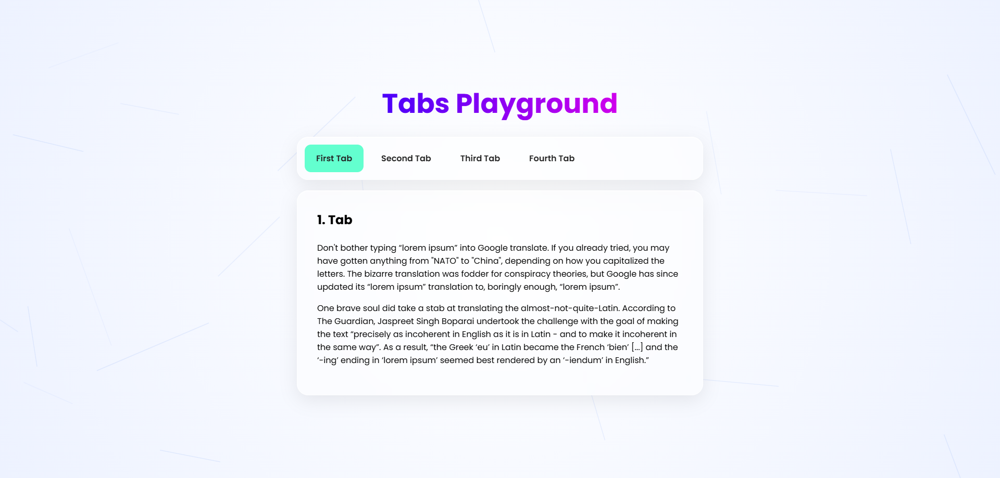

# GSAP-Tabs - Tabs Playground.

[](https://github.com/Darshittank/GSAP-Tabs/stargazers)
[](https://github.com/Darshittank/GSAP-Tabs/network)
[](https://github.com/Darshittank/GSAP-Tabs/issues)
[](https://opensource.org/licenses/MIT)
[](https://darshittank.github.io/Tabs)

## 🎯 Live Demo
👉 **[View GSAP-Tabs Now!](https://darshittank.github.io/GSAP-Tabs/)** 👈

## 🗺️ Roadmap.sh Solution
👉 **[View My Tabs Solution](https://roadmap.sh/projects/simple-tabs/solutions?u=6a54aaccace5f057736e8164)** 👈


## 📌 Project Page
👉 **[Tabs Project](https://roadmap.sh/projects/simple-tabs)** 👈

## 📖 **About GSAP-Tabs**

A modern, responsive tabs component built with GSAP (GreenSock Animation Platform) featuring smooth transitions, animated content, and clean, reusable code.

### 🎯 **Key Features**
- 🧩 Smooth GSAP-powered tab transitions
- 🧩 Responsive design
- 🧩 Lightweight and fast
- 🧩 Easy to customize
- 🧩 Clean HTML, CSS, and JavaScript
- 🧩 Beginner-friendly code structure

## 📸 Preview



📦 Use Cases
- Websites & blogs
- Admin dashboards
- Creative UI designs

🚀 Getting Started
- Paste into your project
- Customize styles as needed

🎯 Goal
- To provide developers and designers with scalable, modern, and efficient Tooltip solutions that save time and improve user experience.

🤝 Contributing
- Contributions are welcome! Feel free to submit new patterns, improvements, or bug fixes.

   

## 🙌 Author

**Darshit**

⭐ Show Your Support

If you like this project, please give it a ⭐ on GitHub! It helps others discover it too.

Made with ❤️ and lots of GSAP-Tabs!

## 🚀 **Installation**

### Local Development

```bash
# Tabs

## Live Demo
https://darshittank.github.io/GSAP-Tabs/

## Repository
https://github.com/Darshittank/GSAP-Tabs

## Roadmap.sh Project
https://roadmap.sh/projects/simple-tabs
